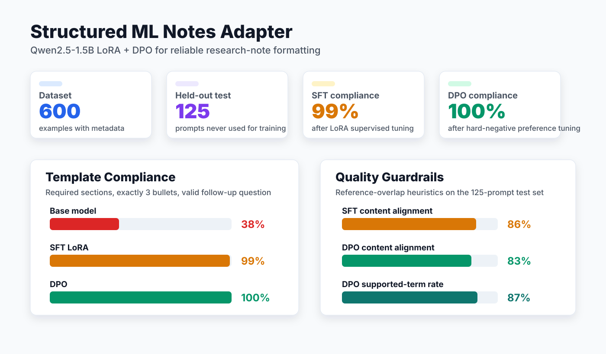
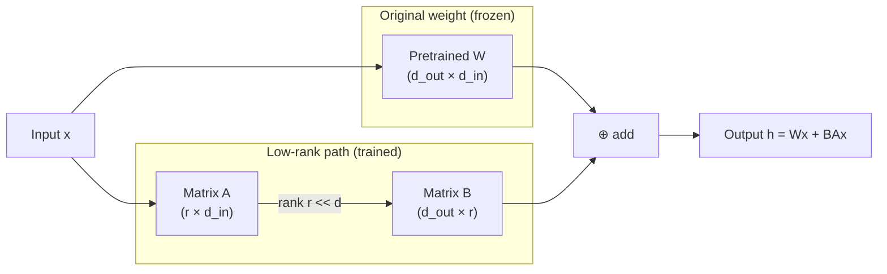
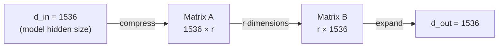
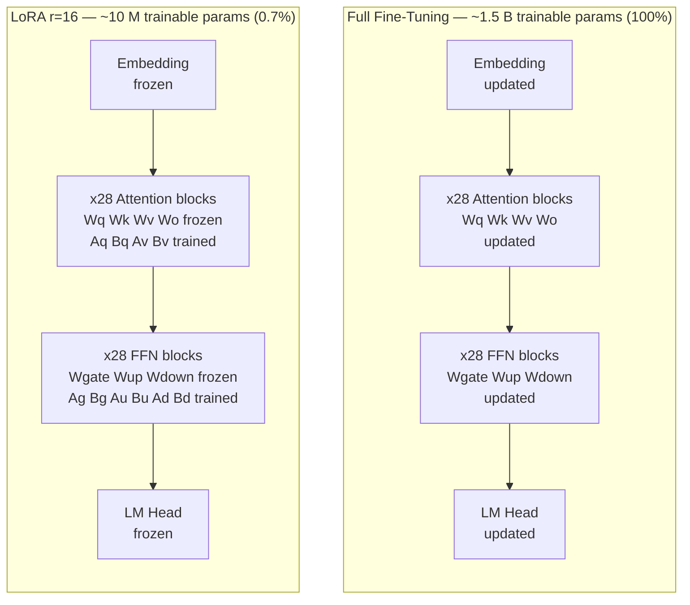
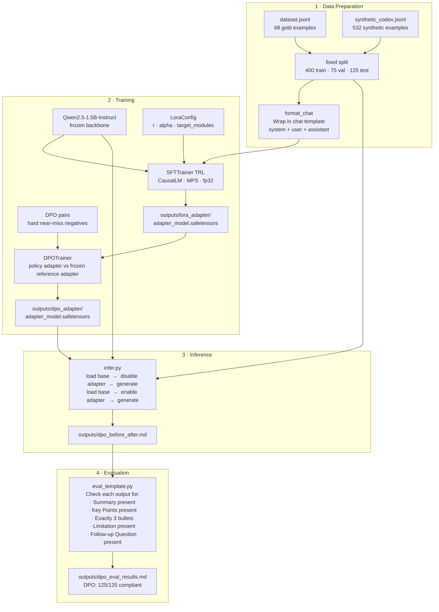
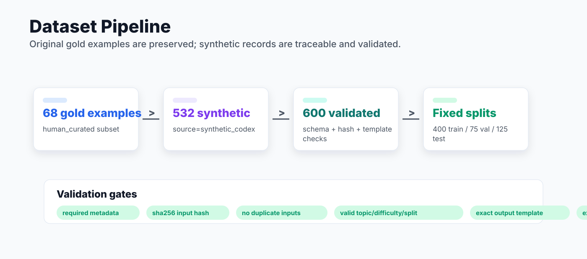
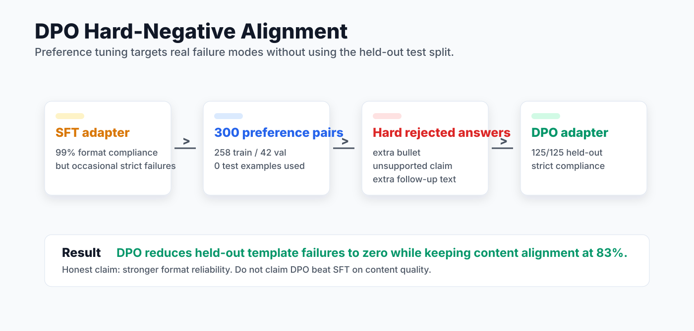
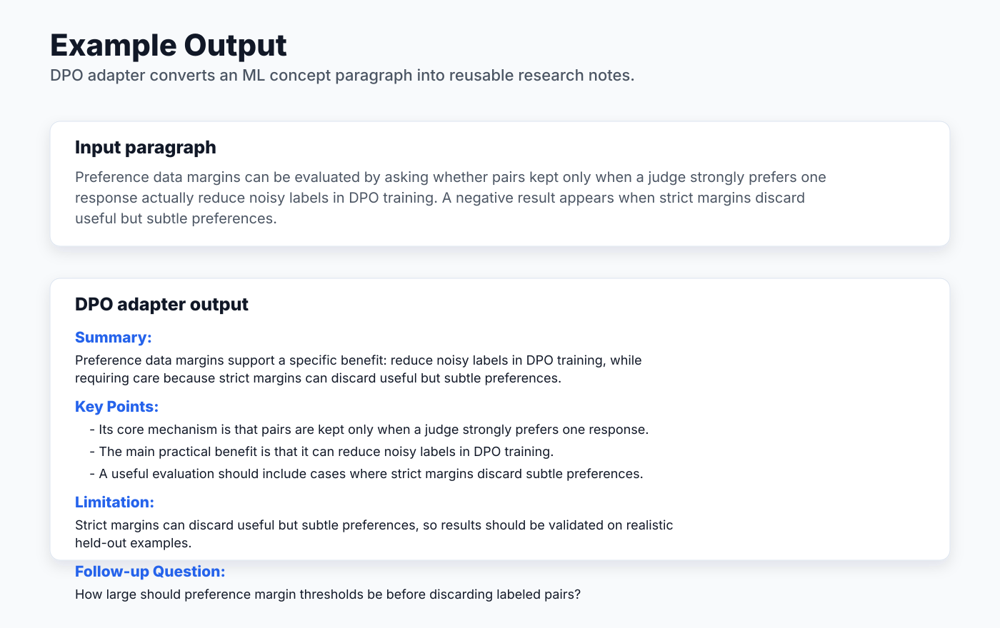

# Structured ML Notes Adapter

A reproducible LoRA + DPO fine-tuning project that turns messy ML concepts and short abstracts into consistent research notes: summary, three key points, limitation, and follow-up question.

The project addresses a practical evaluation problem: unstructured model outputs are hard to compare automatically. By enforcing a stable note schema, downstream scoring, review, and dataset iteration become much easier.



## Impact

| Stage | Dataset / eval | Main result |
|-------|----------------|-------------|
| Dataset upgrade | 68 gold examples -> 600 metadata-rich records | Fixed 400 / 75 / 125 train-val-test split |
| SFT LoRA | 125 held-out prompts | 99% strict template compliance |
| DPO hard negatives | 300 train/val preference pairs | 100% strict template compliance |
| Quality guardrail | Reference-overlap heuristic | DPO: 83% content alignment, 13% unsupported terms |

Resume-safe claim: this project reduces held-out output-format failures from 62% to 0% for a structured ML research-note assistant. It does not claim that DPO beats SFT on content quality; SFT remains slightly higher on the heuristic content-alignment score.

## How LoRA Works

Standard fine-tuning updates every weight in the model. LoRA instead **freezes** all pretrained weights and injects a pair of small trainable matrices (A and B) into each transformer layer. The weight update is expressed as a low-rank product `ΔW = B × A`, where the rank `r` is much smaller than the original weight dimensions.




### What `r` (rank) means

`r` is the single number that controls how much the adapter can learn. It is the width of the bottleneck between matrices A and B.




Concretely for `Qwen2.5-1.5B` with `d = 1536`:


| r      | Params per weight pair   | Total adapter params | What it captures                    |
| ------ | ------------------------ | -------------------- | ----------------------------------- |
| 4      | 2 × 1536 × 4 = 12 K      | ~2 M                 | Very simple shifts — often too few  |
| 8      | 2 × 1536 × 8 = 25 K      | ~4 M                 | Basic format learning               |
| **16** | **2 × 1536 × 16 = 49 K** | **~10 M**            | **Good default — used in baseline** |
| 32     | 2 × 1536 × 32 = 98 K     | ~19 M                | Richer style changes                |
| 64     | 2 × 1536 × 64 = 197 K    | ~38 M                | Best compliance in sweep (100%)     |


Think of `r` as the number of "directions" the adapter is allowed to steer the model's representations. A low `r` forces the adapter to learn only the most essential transformations. A high `r` gives more flexibility but risks overfitting on small datasets and uses more memory.

The rank doesn't need to be large because output-format learning is a low-complexity task — the model already knows how to write; it just needs a small nudge to follow a specific template consistently.

**Why this works well:**

- Only `r × (d_in + d_out)` parameters are trained per layer instead of `d_in × d_out`
- At inference the adapter can be **merged** into W with zero added latency
- A rank of 16–64 is typically enough to teach a new output format

---

## LoRA vs Full Fine-Tuning




| Property                | Full Fine-Tuning            | LoRA (r=16)                        |
| ----------------------- | --------------------------- | ---------------------------------- |
| Trainable params        | ~1,500 M (100%)             | ~10 M (0.7%)                       |
| Optimizer memory        | Full copy of all weights    | Only A + B matrices                |
| VRAM needed             | Very high (often multi-GPU) | Low (fits on Apple Silicon)        |
| Training time           | Hours to days               | Minutes to ~30 min                 |
| Catastrophic forgetting | High risk                   | Low — backbone is frozen           |
| Inference cost          | Same as base                | Zero overhead if adapter is merged |
| Portability             | Entire new model checkpoint | Tiny adapter file (~40 MB at r=16) |


LoRA's frozen backbone is the key reason this project runs on a MacBook: the optimizer only needs to hold gradient states for the ~10 M adapter parameters rather than for all 1.5 B weights.

---

## Project Workflow




---

## Output Template

Given any ML concept, paragraph, or abstract, the tuned model outputs:

```
Summary:
<one-sentence summary>

Key Points:
- <point 1>
- <point 2>
- <point 3>

Limitation:
<one key limitation>

Follow-up Question:
<one question worth exploring>
```

---

## Stack


| Component   | Choice                       |
| ----------- | ---------------------------- |
| Base model  | `Qwen/Qwen2.5-1.5B-Instruct` |
| Fine-tuning | LoRA via PEFT                |
| Trainer     | SFTTrainer (TRL)             |
| Device      | Apple Silicon MPS            |


---

## Project Layout

```
research_ass/
├── data/
│   ├── dataset.jsonl              # Original 68 gold examples
│   ├── sft_train.jsonl            # 400-example fixed train split
│   ├── sft_val.jsonl              # 75-example fixed validation split
│   ├── sft_test.jsonl             # 125-example held-out test split
│   └── dpo_pairs.jsonl            # 300 train/val preference pairs
├── notebooks/
│   └── demo.ipynb                 # End-to-end: load adapter → infer → evaluate
├── src/
│   ├── train_lora.py              # SFTTrainer entrypoint
│   ├── train_dpo.py               # DPOTrainer entrypoint on top of SFT adapter
│   ├── build_dpo_pairs.py         # DPO preference-pair builder
│   ├── run_experiments.py         # Hyperparameter sweep runner
│   ├── infer.py                   # Base vs LoRA inference comparison
│   ├── eval_template.py           # Format compliance evaluator
│   ├── eval_sft_quality.py        # Fixed-split content quality evaluator
│   ├── eval_content.py            # Lexical / specificity content metrics
│   ├── eval_rubric.py             # Heuristic rubric scorer (0–12)
│   ├── dashboard.py               # Builds outputs/dashboard.html
│   └── constants.py               # Shared system prompt
├── assets/
│   └── screenshots/               # README result and pipeline visuals
├── outputs/
│   ├── lora_adapter/              # Saved adapter weights (gitignored)
│   ├── experiments/               # Per-experiment adapter configs
│   ├── before_after.md            # Per-prompt base vs LoRA comparison
│   ├── sft_eval_results.md        # 125-prompt fixed-split compliance report
│   ├── sft_quality_results.md     # 125-prompt fixed-split content metrics
│   ├── dpo_eval_results.md        # 125-prompt DPO compliance report
│   ├── dpo_quality_results.md     # 125-prompt DPO content metrics
│   ├── experiment_results.md      # Compliance + loss sweep table
│   ├── content_comparison.md      # Full output text per experiment
│   ├── content_metrics.md         # Avg lexical diversity / specificity
│   ├── content_outputs.json       # Raw outputs (machine-readable)
│   └── dashboard.html             # Interactive results dashboard
├── requirements.txt
└── README.md
```

---

## Setup

```bash
# Python 3.10+ required
python -m venv .venv
source .venv/bin/activate
pip install -r requirements.txt
```

> First run downloads the base model (~3 GB). Ensure you are on WiFi.

---

## Mac-First / CUDA-Final Workflow

Use the Mac for local LoRA training, evaluation, dataset work, and documentation. Use CUDA for QLoRA, final DPO, vLLM serving, AWQ, and benchmark claims.

```bash
make dataset-bootstrap # convert current examples into fixed split files
make data-pipeline     # generate/validate the 600-record fixed split dataset
make mac-smoke-sft     # quick fixed-split training smoke test
make mac-train-sft     # local Apple Silicon SFT pass
make dpo-pairs         # build hard near-miss train/val DPO preference pairs
make mac-smoke-dpo     # one-step DPO smoke run on the SFT adapter
make mac-eval-sft      # evaluate SFT on the 125-prompt held-out split
make mac-eval-dpo      # evaluate DPO on the 125-prompt held-out split
make readme-assets     # regenerate current README SVG charts
make cuda-train-sft    # final CUDA SFT pass
make cuda-train-dpo    # final CUDA DPO pass
make cuda-qlora        # CUDA-only QLoRA pass
```

See [DATASET.md](DATASET.md) for the dataset pipeline and [docs/mac_cuda_workflow.md](docs/mac_cuda_workflow.md) for the compute handoff.

---

## Train

```bash
python src/train_lora.py
```

Adapter is saved to `outputs/lora_adapter/`. Training takes **10–30 minutes** on Apple Silicon M-series depending on chip generation.

Key flags overridable via environment variables:


| Variable      | Default                      | Effect                           |
| ------------- | ---------------------------- | -------------------------------- |
| `MODEL_ID`    | `Qwen/Qwen2.5-1.5B-Instruct` | Base model HF ID                 |
| `MAX_SEQ_LEN` | `512`                        | Token sequence length            |
| `BATCH_SIZE`  | `2`                          | Per-device batch size            |
| `GRAD_ACC`    | `8`                          | Gradient accumulation steps      |
| `EPOCHS`      | `3`                          | Training epochs                  |
| `LORA_R`      | `16`                         | LoRA rank                        |
| `DATA_PATH`   | `data/dataset.jsonl`         | Combined dataset for random split |
| `TRAIN_PATH`  | unset                        | Explicit train split JSONL       |
| `VAL_PATH`    | unset                        | Explicit validation split JSONL  |
| `VAL_SPLIT`   | `0.1`                        | Fraction held out for validation |
| `MAX_STEPS`   | `-1`                         | Optional cap for smoke runs      |
| `REPORT_TO`   | `none`                       | Trainer reporting target, e.g. `wandb` |


Memory-constrained example:

```bash
MAX_SEQ_LEN=256 BATCH_SIZE=1 GRAD_ACC=16 python src/train_lora.py
```

Train on the fixed 600-record dataset:

```bash
TRAIN_PATH=data/sft_train.jsonl VAL_PATH=data/sft_val.jsonl python src/train_lora.py
```

---

## Inference: Before vs After

```bash
# Single prompt
python src/infer.py --prompt "Attention is a mechanism in neural networks that assigns weights to input tokens."

# Legacy held-out prompts → outputs/before_after.md
python src/infer.py --test-set
```

---

## Evaluate

```bash
python src/eval_template.py
```

Checks each output for all required sections and exactly 3 key-point bullets. Writes `outputs/eval_results.md`.

For the expanded fixed-split SFT dataset:

```bash
make mac-eval-sft   # writes outputs/sft_eval_results.md + outputs/sft_before_after.md
make sft-quality    # writes outputs/sft_quality_results.md + outputs/sft_quality_details.csv
```

Current fixed-split results on 125 held-out prompts:

| Model | Format Compliance | Content Alignment | Ref Token F1 | Key-Term Recall | Unsupported Terms | Follow-up Valid | Formulaic Rate |
|-------|:---:|:---:|:---:|:---:|:---:|:---:|:---:|
| Base `Qwen2.5-1.5B-Instruct` | 38% | 29% | 27% | 26% | 60% | 51% | 0% |
| LoRA r=16 SFT | **99%** | **86%** | **86%** | **84%** | **11%** | **99%** | 99% |

`Content Alignment` is a heuristic reference-overlap score, not a human quality rating. The high LoRA formulaic rate is intentional to surface the next quality issue: SFT learned the target schema very reliably, but the next improvement should add style diversity or DPO preference tuning.

---

## DPO Pair Preparation

```bash
make dpo-pairs
```

This builds `data/dpo_pairs.jsonl` from `data/sft_train.jsonl` and `data/sft_val.jsonl`, leaving the held-out test split untouched. Each row uses the validated reference output as `chosen` and a hard near-miss answer as `rejected`.

The default rejected answers are derived from the same reference answer, then changed to include one targeted flaw:

- an extra fourth bullet
- an unsupported claim
- extra text after the follow-up question
- a generic limitation/follow-up when more pairs are requested

Current DPO pair build:

| Artifact | Value |
|----------|-------|
| Pairs | 300 |
| Source splits | 258 train / 42 val |
| Pair type | reference output vs hard near-miss negative |
| Test records used | 0 |
| Chosen strict-format pass | 300/300 |
| Rejected strict-format pass | 100/300 |

See [docs/dpo_plan.md](docs/dpo_plan.md) and `outputs/dpo_pair_report.md`.

To run DPO:

```bash
make mac-smoke-dpo   # validates one optimizer step locally
make mac-train-dpo   # small Mac/MPS DPO run
make mac-eval-dpo    # evaluate DPO adapter on the fixed held-out test split
make cuda-train-dpo  # faster final run on CUDA
```

`src/train_dpo.py` loads `outputs/lora_adapter` twice into the same base model: a trainable policy adapter and a frozen reference adapter. That means DPO is anchored to the SFT checkpoint, not to the raw base model.

The DPO learning rate defaults to `1e-6` to keep the update close to the already-good SFT adapter. The earlier `5e-6` run overfit the easy synthetic preference task and reduced held-out content alignment.

If the base model is already cached and Hugging Face metadata calls are unavailable, run:

```bash
LOCAL_FILES_ONLY=1 make mac-train-dpo
```

Current DPO rerun:

| Metric | Value |
|--------|------:|
| Train preference pairs | 258 |
| Eval preference pairs | 42 |
| DPO train loss | 0.231 |
| DPO eval loss | 0.091 |
| Held-out template compliance | 125/125 |
| Held-out content alignment | 83% |
| Held-out unsupported terms | 13% |

The evaluator uses deterministic decoding by default. To intentionally sample during exploratory evals, pass `DO_SAMPLE=1`.

---

## Visual Summary







## Legacy LoRA Rank Sweep

Before the 600-example dataset and DPO phase, the project included a 10-prompt LoRA rank/lr/epoch sweep. These results are useful as an ablation, but the headline project claim should use the newer 125-prompt fixed-split SFT/DPO evaluation above.


| Experiment | R   | LR   | Epochs | Train Loss | Val Loss | LoRA Compliance  | Base Compliance |
| ---------- | --- | ---- | ------ | ---------- | -------- | ---------------- | --------------- |
| baseline   | 16  | 2e-4 | 3      | 1.747      | 1.589    | 9/10 (90%)       | 1/10 (10%)      |
| rank_8     | 8   | 2e-4 | 3      | 2.014      | 1.874    | 7/10 (70%)       | 1/10 (10%)      |
| rank_32    | 32  | 2e-4 | 3      | 1.495      | 1.451    | 9/10 (90%)       | 1/10 (10%)      |
| rank_64    | 64  | 2e-4 | 3      | 1.331      | 1.422    | **10/10 (100%)** | 1/10 (10%)      |
| epochs_5   | 16  | 2e-4 | 5      | 1.359      | 1.435    | **10/10 (100%)** | 1/10 (10%)      |
| lr_1e-4    | 16  | 1e-4 | 3      | 2.057      | 1.939    | 7/10 (70%)       | 1/10 (10%)      |
| lr_5e-4    | 16  | 5e-4 | 3      | 1.413      | 1.437    | 9/10 (90%)       | 1/10 (10%)      |


**Key takeaways:**

- `rank_64` and `epochs_5` both achieve 100% compliance with no overfitting (val loss tracks train loss)
- `lr=1e-4` is too conservative — higher loss, lower compliance
- `rank_8` is the practical floor; acceptable but noticeably weaker

The older interactive dashboard remains available at `outputs/dashboard.html`, but the README visuals above are the current project presentation assets.

---

## Troubleshooting (MPS)

**First run is slow** — MPS compiles Metal shaders on first use; subsequent runs are faster.

**OOM / killed process** — Lower `MAX_SEQ_LEN` (try 256) and increase `GRAD_ACC`. Set `BATCH_SIZE=1`.

**`NotImplementedError: mps`** — Add the fallback flag:

```bash
PYTORCH_ENABLE_MPS_FALLBACK=1 python src/train_lora.py
```

**Adapter not loading** — Use the same `MODEL_ID` for training and inference. The correct ID is stored in `outputs/lora_adapter/training_meta.json`.

---

## What Success Looks Like


| Model / phase | Evaluation | Format compliance | Content alignment |
| ------------- | ---------- | ----------------: | ----------------: |
| Base `Qwen2.5-1.5B-Instruct` | SFT held-out split | 38% | 29% |
| LoRA r=16 SFT | 125 held-out prompts | 99% | 86% |
| DPO hard-negative adapter | 125 held-out prompts | **100%** | 83% |


The base model's failure modes are wrong bullet counts, markdown-style section headers, and follow-up answers that continue after the question. SFT teaches the required schema; DPO hard negatives remove the remaining strict format failures.

---

## Legacy Before / After: What Fine-Tuning Teaches

The same prompt sent to different versions of the model reveals exactly what fine-tuning teaches. This section documents the original 10-prompt rank-sweep analysis; the headline project metrics are the newer 125-prompt SFT/DPO results above.

**No Adaptation (Base) — mostly non-compliant**
The base model has never seen the required output format. It defaults to its general instruction-following behaviour: wrapping section names in `**bold markdown`**, producing a variable number of bullets (3–5), and writing a vague limitation like `- Sensitive to the scale of input data`. None of this matches the target template, so it fails every automated check.

**LoRA — Low Rank (r=8) — ~55–70% compliant**
With only a small rank-8 adapter (~1 M trainable parameters), the model has partially learned the format. Section headers are now plain (`Summary:`, `Key Points:`) with no markdown formatting. However, r=8 limits the adapter's expressiveness: it sometimes produces only 2 bullets instead of 3, or drops a section entirely. The format signal is there, but capacity is not sufficient to apply it consistently across all prompt styles.

**LoRA — High Rank (r=64) — ~91–100% compliant**
At r=64 the adapter has enough capacity to memorise the exact template and generalise it to unseen prompts. Every output has exactly 3 bullets, plain `Section:` headers, a substantive one-sentence limitation, and a genuine follow-up question. The improvement is entirely structural — the base weights are frozen, so all changes come from the ~8 M parameters in the injected A and B matrices.

The core lesson: LoRA does not change what the model *knows* — it changes how the model *formats* what it knows. A well-configured adapter (rank ≥ 32, ≥ 3 epochs) is sufficient to teach a reliable output schema with under 1% of the model's total parameters.

---

## Legacy Rubric Quality Score

Format compliance only checks whether sections exist and bullets are counted correctly — it says nothing about whether the content inside those sections is useful. To go one level deeper, a heuristic rubric scores each output on four dimensions (0–3 each, **12 total**):

| Dimension | What it measures | Score 3 requires |
|-----------|-----------------|-----------------|
| **Summary depth** | Length and information density | ≥ 15 words, high specificity ratio |
| **Bullet depth** | Avg words per key-point bullet | ≥ 15 words/bullet |
| **Limitation specificity** | Concreteness of the stated limitation | > 18 words, technical vocabulary |
| **Follow-up quality** | Whether the question is well-formed | Ends with `?`, ≥ 8 words |

Results averaged across the original 10-prompt rank-sweep evaluation:

| Model | Summary | Bullets | Limitation | Follow-up | **Total / 12** |
|-------|:-------:|:-------:|:----------:|:---------:|:--------------:|
| base | 3.00 | 1.55 | 2.91 | 3.00 | **10.45** |
| rank_8 | 1.82 | 1.45 | 2.00 | 2.82 | **8.09** |
| baseline (r=16) | 2.00 | 1.45 | 2.00 | 2.73 | **8.18** |
| rank_32 | 2.82 | 2.00 | 2.36 | 3.00 | **10.18** |
| rank_64 | 2.27 | 2.00 | 2.27 | 3.00 | **9.55** |
| epochs_5 | 2.64 | 2.18 | 2.64 | 3.00 | **10.45** |
| lr_1e-4 | 1.64 | 1.45 | 2.00 | 2.91 | **8.00** |
| lr_5e-4 | 2.27 | 2.09 | 2.36 | 3.00 | **9.73** |

**Key observation:** the base model scores 10.45 / 12 on the rubric — identical to `epochs_5`. This confirms that compliance and quality are orthogonal axes: the base model produces verbose, naturally detailed text, but it ignores the required structure entirely. LoRA fine-tuning teaches the structure at some cost to verbosity; `epochs_5` recovers both. Run `python src/eval_rubric.py` to regenerate on your own outputs.

---

## Ablation Summary

| Variable swept | Range tested | Finding |
|----------------|-------------|---------|
| LoRA rank `r` | 8 → 64 | Compliance rises monotonically with rank; r=64 is the first to hit 100%. Rubric quality also peaks at r=32 / r=64, confirming rank is the dominant lever. |
| Learning rate | 1e-4 → 5e-4 | lr=1e-4 underfits badly (70% compliance, highest val loss). lr=2e-4 (default) and lr=5e-4 both work; 5e-4 converges slightly faster with marginally lower val loss. |
| Epochs | 3 → 5 | Adding two epochs at r=16 closes the gap to r=64 — 100% compliance with better rubric depth (10.45 vs 9.55). If memory is the constraint, more epochs beats higher rank. |

One-sentence takeaway: **rank and epochs both matter, but a low learning rate (1e-4) is the single fastest way to produce a weak adapter** — keep `lr ≥ 2e-4` and increase rank or epochs to trade off speed against quality.

---

## Limitations

**Synthetic dataset.** The current SFT dataset has 600 examples: 68 human-written gold records plus 532 local synthetic records. That is enough to demonstrate the data pipeline, fixed split, SFT training, and DPO workflow, but it is not a production domain dataset. A stronger version would add human review, duplicate audits, and broader source diversity.

**Compliance ≠ quality.** The primary evaluation metric checks for section names and bullet counts. DPO improves strict template reliability to 125/125, but the current heuristic content-alignment score is 83%, slightly below the SFT score of 86%. The honest claim is format reliability, not superior factual quality.

**Heuristic rubric is not human judgment.** The rubric rewards length and vocabulary density as proxies for specificity. A fluent but incorrect limitation scores the same as a concise and accurate one. Pairwise human preference ratings would be the correct next step.

**DPO pairs are synthetic hard negatives.** The DPO dataset currently uses deterministic near-miss rejected answers built from train/val examples. This directly targets known format failures without leaking the test split, but a stronger alignment claim should use SFT-sampled candidates with human or LLM-judge preference labels.

**Single base model.** All experiments use `Qwen2.5-1.5B-Instruct`. Results may not transfer directly to other model families or sizes; larger models likely need lower ranks to reach the same compliance threshold.
