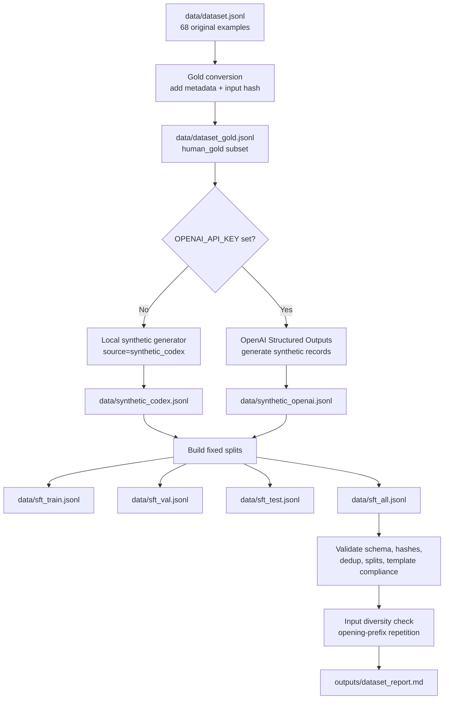

# Data Pipeline

This pipeline upgrades the original 68 `input` / `output` examples into metadata-rich fixed train/validation/test files.

## Flow



## Run It

Local generation, no paid API call:

```bash
./data_pipeline.sh
```

Generate the full local synthetic dataset:

```bash
OPENAI_API_KEY=... GEN_MODEL=gpt-4o-mini ./data_pipeline.sh
```

Equivalent Make target:

```bash
make data-pipeline
```

## Output Files

| File | Purpose |
|---|---|
| `data/dataset_gold.jsonl` | Original 68 examples with metadata added |
| `data/synthetic_codex.jsonl` | Local generated records, no API key |
| `data/synthetic_openai.jsonl` | Optional generated synthetic records |
| `data/sft_all.jsonl` | Combined dataset after deduplication |
| `data/sft_train.jsonl` | Fixed training split |
| `data/sft_val.jsonl` | Fixed validation split |
| `data/sft_test.jsonl` | Held-out test split |
| `outputs/dataset_report.md` | Validation report |

Default target counts after local generation:

| Split | Count |
|---|---:|
| Train | 400 |
| Validation | 75 |
| Test | 125 |
| Total | 600 |

## Record Schema

```json
{
  "id": "gold_0001",
  "input": "...",
  "output": "...",
  "source": "human_gold",
  "topic": "architectures",
  "difficulty": "intermediate",
  "split": "train",
  "input_sha256": "..."
}
```

Synthetic rows also include:

```json
{
  "generation_model": "gpt-4o-mini"
}
```

## Validation Checks

The validator checks:

- required fields exist
- `input_sha256` matches normalized input text
- duplicate IDs are rejected
- duplicate inputs are rejected
- topic, difficulty, and split values are valid
- output follows the required template
- `Key Points` has exactly three bullets
- average input length and repeated 4-word opening prefixes

## Training With Fixed Splits

After the pipeline runs:

```bash
TRAIN_PATH=data/sft_train.jsonl \
VAL_PATH=data/sft_val.jsonl \
make mac-train
```

On CUDA:

```bash
TRAIN_PATH=data/sft_train.jsonl \
VAL_PATH=data/sft_val.jsonl \
make cuda-train
```
