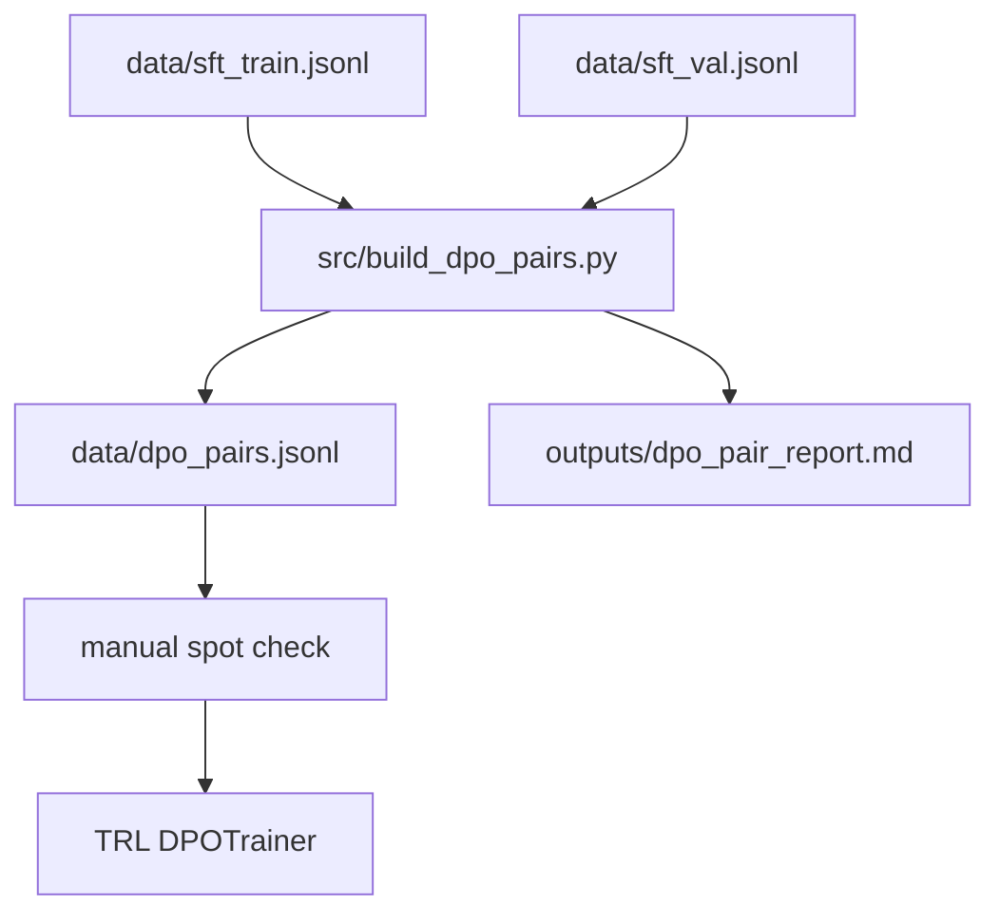

# DPO Upgrade Plan

This phase improves style and preference quality after SFT. The SFT adapter already learned the required schema, so DPO should not teach a new format. It should prefer cleaner, less repetitive answers while preserving the exact output template and the SFT content style.

## Goal

Create a preference dataset that targets the current SFT/DPO weaknesses:

- extra key-point bullets
- unsupported or hallucinated claims
- extra text after the follow-up question
- generic limitations and follow-up questions

## Pipeline



## Schema

Each JSONL row contains:

| Field | Meaning |
|-------|---------|
| `id` | Preference-pair id |
| `prompt` | User input text |
| `chosen` | Preferred response |
| `rejected` | Worse response |
| `source_id` | Original SFT record id |
| `source_split` | `train` or `val` |
| `topic` | Dataset topic |
| `difficulty` | Dataset difficulty |
| `pair_source` | How the pair was built |
| `chosen_source` | Source of the chosen answer |
| `rejected_source` | Source of the rejected answer |
| `issue_tags` | Rejected-answer flaws |
| `input_sha256` | Input hash for traceability |

## Command

```bash
make dpo-pairs
```

This writes:

- `data/dpo_pairs.jsonl`
- `outputs/dpo_pair_report.md`

Default build settings:

| Setting | Value |
|---------|-------|
| Pair count | 300 |
| Pair source | `data/sft_train.jsonl` + `data/sft_val.jsonl` |
| Chosen answer | validated reference output |
| Rejected answer | hard near-miss derived from the reference |
| Pairs per source record | 3 |
| Test split used | no |

## Training Commands

```bash
make mac-smoke-dpo   # one optimizer step, fastest sanity check
make mac-train-dpo   # local Mac/MPS DPO pass
make mac-eval-dpo    # evaluate DPO adapter on the fixed held-out test split
make cuda-train-dpo  # CUDA DPO pass
```

The DPO trainer loads the SFT adapter twice into one base model:

- `default`: trainable policy adapter
- `reference`: frozen reference adapter

This keeps the reference policy equal to the SFT checkpoint instead of comparing DPO updates against the raw base model.

## Current Local Result

The hard-pair Mac/MPS rerun used 300 preference pairs: 258 train and 42 eval. The DPO adapter was trained for one epoch at `1e-6` learning rate.

| Metric | Value |
|--------|------:|
| DPO train loss | 0.231 |
| DPO eval loss | 0.091 |
| Held-out template compliance | 125/125 |
| Held-out content alignment | 83% |
| Held-out follow-up validity | 100% |

The two previous targeted failures, `codex_0374` and `codex_0375`, now pass under deterministic decoding.

## Why Train/Val Only

The held-out `data/sft_test.jsonl` split must stay clean for final comparison. The DPO pair builder refuses records marked `split=test` unless `--allow-test` is passed explicitly.

## Important Caveat

The preference file still uses deterministic near-miss negatives rather than fresh sampled generations from the SFT model. That is acceptable for a local DPO iteration because it directly targets known failures, but a final resume-quality DPO claim should use actual SFT-generated candidates plus human or LLM-judge preference labels.
